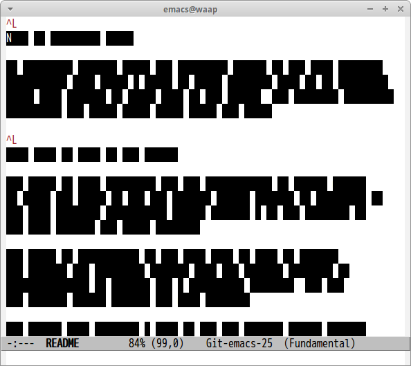

# kuronuri.el

Make like Japanese secret document([See examples](https://www.google.co.jp/search?biw=1366&bih=666&tbm=isch&sa=1&q=黒塗り+文書&oq=黒塗り+文書&gs_l=img.3..0i4i10i37i24.1628.6464.0.7071.34.23.0.0.0.0.165.1962.16j5.21.0....0...1c.1.64.img..18.15.1486.ZFuC9AEhvEo))

## Screenshot

## Commands

#### `M-x kuronuri-buffer`

Mask buffer

#### `M-x kuronuri-region`

Mask region

#### `M-x kuronuri-clean`

Clean masks
